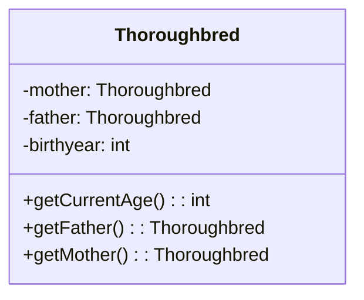
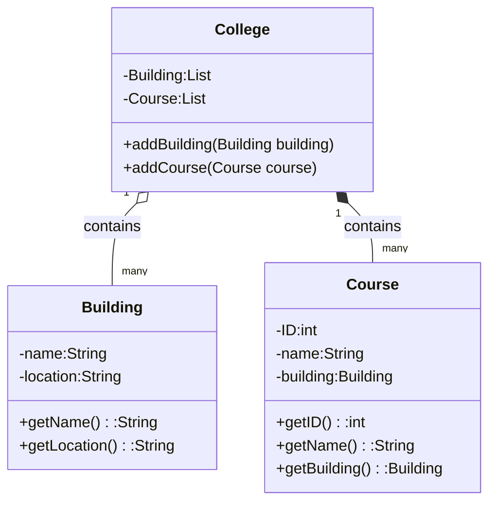
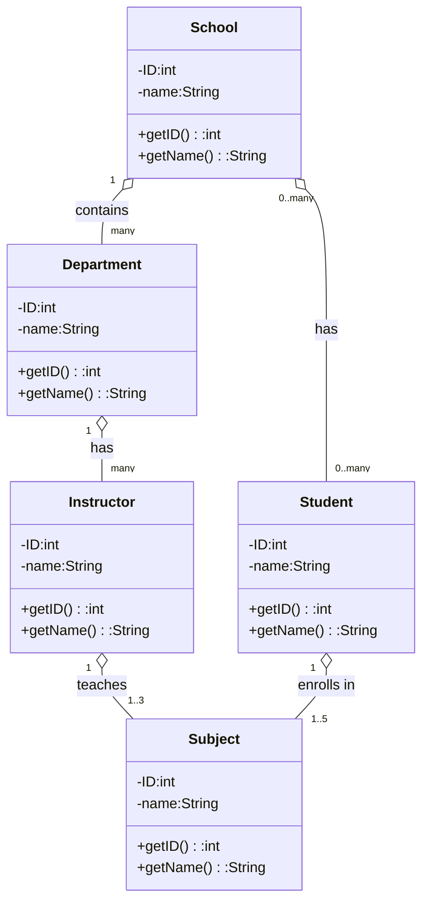
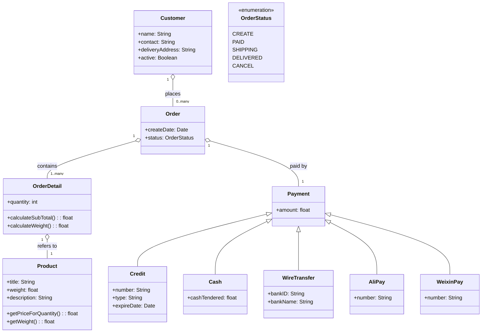

### A1-1

```mermaid
classDiagram
    class Thoroughbred {
        -mother: Thoroughbred
        -father: Thoroughbred
        -birthyear: int
        +getCurrentAge(): int
        +getFather(): Thoroughbred
        +getMother(): Thoroughbred
    }
```

### A1-2

```mermaid
classDiagram
    class College {
        -Building:List<Building>
        -Course:List<Course>
        +addBuilding(Building building)
        +addCourse(Course course)
    }
    class Building {
        -name:String
        -location:String
        +getName():String
        +getLocation():String
    }
    class Course {
        -ID:int
        -name:String
        -building:Building
        +getID():int
        +getName():String
        +getBuilding():Building
    }
    College "1" o-- "many" Building : contains
    College "1" *-- "many" Course : contains
```

### A1-3

```mermaid
classDiagram
    class School {
        -ID:int
        -name:String
        +getID():int
        +getName():String
    }
    class Department {
        -ID:int
        -name:String
        +getID():int
        +getName():String
    }
    class Instructor {
        -ID:int
        -name:String
        +getID():int
        +getName():String
    }
    class Subject {
        -ID:int
        -name:String
        +getID():int
        +getName():String
    }
    class Student {
        -ID:int
        -name:String
        +getID():int
        +getName():String
    }

    School "1" o-- "many" Department : contains
    Department "1" o-- "many" Instructor : has
    Instructor "1" o-- "1..3" Subject : teaches
    School "0..many" o-- "0..many" Student : has
    Student "1" o-- "1..5" Subject : enrolls in
```

### A1-4

```mermaid
classDiagram
    class Customer {
        +name: String
        +contact: String
        +deliveryAddress: String
        +active: Boolean
    }

    class Order {
        +createDate: Date
        +status: OrderStatus
    }

    class OrderDetail {
        +quantity: int
        +calculateSubTotal(): float
        +calculateWeight(): float
    }

    class Product {
        +title: String
        +weight: float
        +description: String
        +getPriceForQuantity(): float
        +getWeight(): float
    }

    class Payment {
        +amount: float
    }

    class Credit {
        +number: String
        +type: String
        +expireDate: Date
    }

    class Cash {
        +cashTendered: float
    }

    class WireTransfer {
        +bankID: String
        +bankName: String
    }

    class AliPay {
        +number: String
    }

    class WeixinPay {
        +number: String
    }

    class OrderStatus {
        <<enumeration>>
        CREATE
        PAID
        SHIPPING
        DELIVERED
        CANCEL
    }

    Customer "1" o-- "0..many" Order : places
    Order "1" o-- "1..many" OrderDetail : contains
    OrderDetail "1" o-- "1" Product : refers to
    Order "1" o-- "1" Payment : paid by
    Payment <|-- Credit
    Payment <|-- Cash
    Payment <|-- WireTransfer
    Payment <|-- AliPay
    Payment <|-- WeixinPay
```